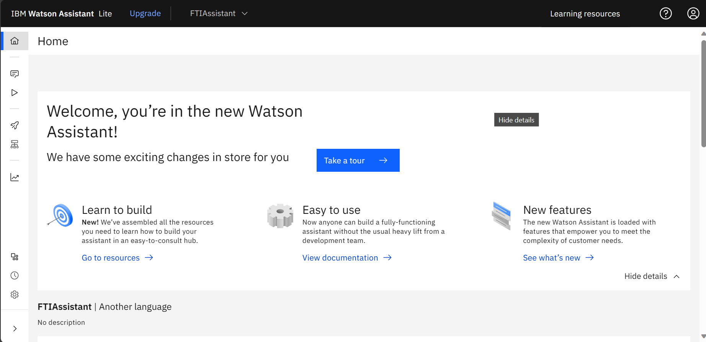
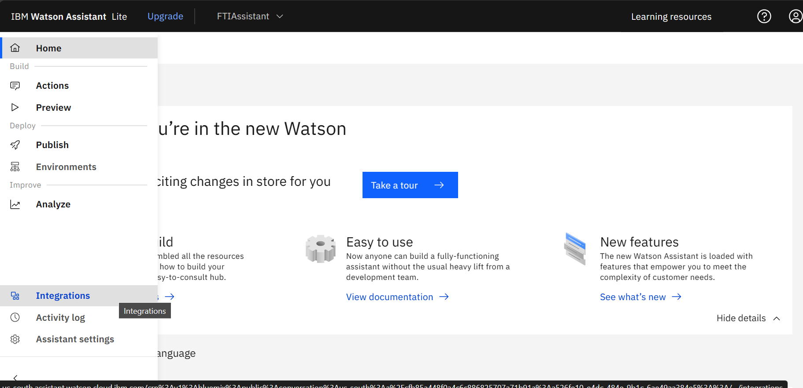
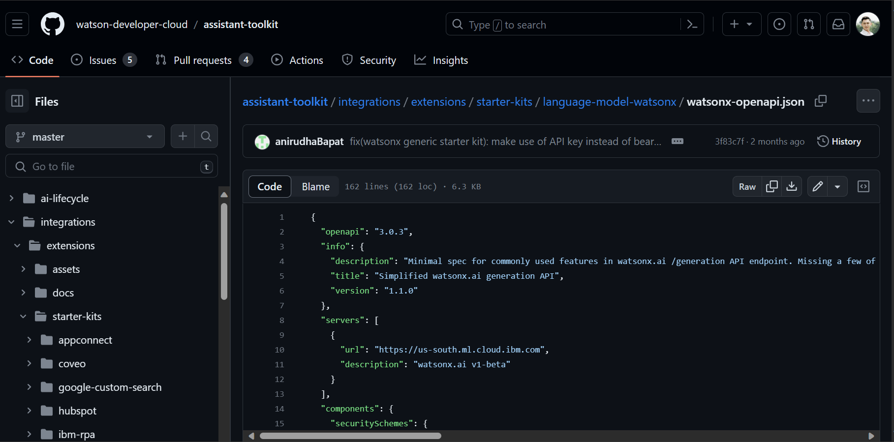
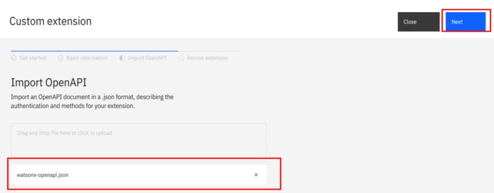

The following are the steps in the process of creating an FTI Assistant Chatbot using the Watson Assistant platform. 
This chatbot is designed to provide interactive and efficient solutions for users in accessing information and 
services available at the Faculty of Information Technology (FTI).

## Watson Assistant
  * Here I used `Watson Assistant` in the resource list menu, then `Launch Watson Assistant`. Next, I entered the
    Assistant Name as `FTI Assistant`, while for the Description it was `Optional`, and for Language select `English
    (US)`.
  * The following is a display of the project in Watson Assistant that was successfully created.
    
  * Next, how I did the Watson Assistant integration.
    
  * Download the Json Extensions at the following link: [Json](https://github.com/watsondeveloper-cloud/assistant-toolkit/blob/master/integrations/extensions/starterkits/language-model-watsonx/watsonx-openapi.json) or Copy this link!

```bash
https://github.com/watsondeveloper-cloud/assistant-toolkit/blob/master/integrations/extensions/starterkits/language-model-watsonx/watsonx-openapi.json
```
  
  
  * Here I insert the json file that has been downloaded for integration.
      
  * After creating the `Extension`, my next step was to `Add` the Watson Extension. and do `Confirm`.
