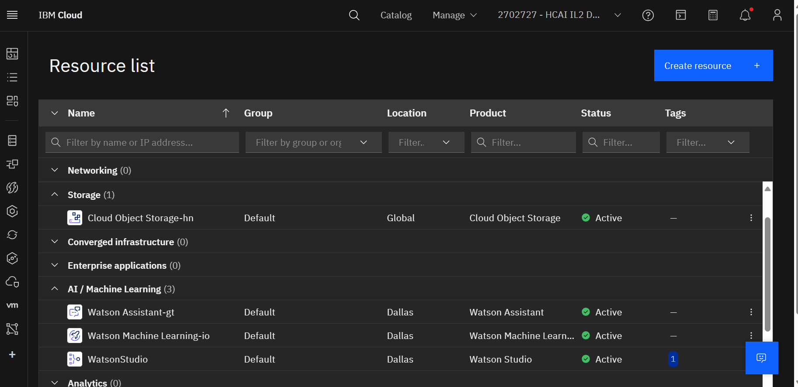

Below I explain in detail the steps I have taken while working on this Capstone Project. Every step taken has been carefully designed to achieve the main objectives of this project and deliver appropriate results.

# Preparation for Create Service
Before I can use Watson services, there are several services I have to create first. Here are the steps.

## Create Watson Machine learning
  * Here I Login to the IBM Cloud account using the appropriate credentials [IBM Cloud](https://cloud.ibm.com/login).
    After logging into the IBM Cloud Dashboard, the `Watson Machine Learning` service in the service catalog became
    my choice. then `Dallas (US-South)` as my location.

## Create Watson Studio
  * Next I used `Watson Studio` in the service catalog and again selected `Dallas (us-south)`.

## Create Object Storage
  * Here I repeat Steps 1 and 2 then select Select `Infrastructure` namely IBM Cloud, and make sure the service is
    free.

## Create Watson Assistant
  * Next, in the main IBM Cloud Dashboard, I selected the `Watson Assistant` service and set its location to `Dallas
    (us-south)` again.

     The following displays the `Resource List` which explains the status of the services that have been created.

## Create Watsonx
  * Then I went back to the Catalog page, and created Watsonx and set the server location to `Dallas (us-south)`.
