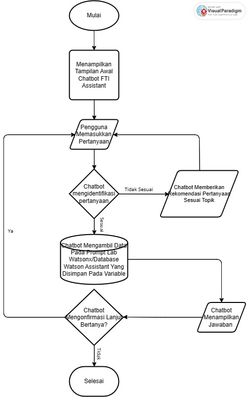

# 📚 Watsonx: FTI Assistant Chatbot for Improving Student Information Access in UKSW FTI Academic Environment

 

  

 

FTI Assistant is a simple chatbot for UKSW FTI academic information. Created for students & amp; general public, this chatbot provides general information with a user-friendly interface and easy access and interaction.

## 🛠 Problem
Project "FTI Assistant Chatbot to Improve Student Information Access in The UKSW FTI Academic Environment "started from the problem of information accessibility
academics for students at the University's Faculty of Information Technology (FTI). Satya Wacana Christian (UKSW). In the digital era and technological developments
artificial intelligence (AI), students often face difficulties in obtaining information they need, especially related to academic administration. Lecturer and administrative staff are also burdened by routine tasks in handling inquiries the same or repeated from students. Therefore, innovative solutions are needed to
increase access to information, reduce workload, and improve experience student.

## 💡 Solution
The proposed solution is to develop a chatbot named “FTI Assistant.” This chatbot will be a virtual assistant that can answer questions from students and the general public regarding information at SWCU FTI. With Utilizing IBM Cloud artificial intelligence (AI) technology and natural language processing (NLP), this chatbot will be able to respond to questions quickly and accurately. Project steps include requirements analysis, chatbot design on the Watson Assistant service, developing an AI model using WatsonX Prompt Lab, integrating data, testing, implementing on the web, and carrying out evaluation if necessary.

## Project Steps
1. Requirements Analysis: Identify and document chatbot requirements.
2. Chatbot Design: Develop on the Watson Assistant service.
3. AI Model Development: Use WatsonX Prompt Lab to build a robust AI model.
4. Data Integration: Connect relevant data sources.
5. Testing & Implementation: Test thoroughly, then deploy on the web.
6. Evaluation: Continuously evaluate and improve based on user feedback.

## 🎯 Objectives
1. Increase the accessibility of academic information for students, ensuring that
they can easily access the information they need without obstacle.
2. Reduce the workload of lecturers and administrative staff by enabling chatbots
handle routine, same, or repeated questions from students, so that they can focus on more strategic tasks.
3. Implement artificial intelligence (AI) and language processing technology
natural (NLP) to develop responsive and efficient chatbots in respond to user questions.
4. Improve the student experience by providing fast and easy access to the information they need, so they feel supported and helped
in their academic journey.

The overall goal of this project is to increase internal efficiency providing information about UKSW FTI, improving the student experience, and
introducing artificial intelligence (AI) technology to the UKSW FTI environment.

## Included Components
* [IBM Watson Assistant]: Build, test and deploy a bot or virtual agent across mobile devices, messaging platforms, or even on a physical robot.
* [IBM Watsonx](https://www.ibm.com/watsonx): Easily train, validate, fine-tune, and deploy basic and machine learning models..

## 🔄 Project Flowchart Chatbot FTI UKSW

*Diagram alur proses Chatbot FTI UKSW.*

## 📁 Table of Contents
| Name | Contents |
| -------- | -------- |
| Capstone Project Services | [`Capstone Project Services`](https://github.com/Demianus/FTI-Assistant/blob/6f08d38ff08cfba8071213a39784079995e9cf8d/Preparation%20for%20Create%20Service%20Project%20Capstone.md) |
| Creating an FTI Assistant Chatbot in Watson Assistant | [`Creating an FTI Assistant Chatbot in Watson Assistant`](https://github.com/Demianus/FTI-Assistant/blob/1f9265a244757acee504577beabef9810a5b8028/Creating%20an%20FTI%20Assistant%20Chatbot%20in%20Watson%20Assistant.md) |
| Creating an FTI Assistant Chatbot Lab Prompt in Watsonx | [`Creating an FTI Assistant Chatbot Lab Prompt in Watsonx`](https://github.com/Demianus/FTI-Assistant/blob/20d3b122dc6c8d442a43b6cf6f131809a81bf097/Creating%20an%20FTI%20Assistant%20Chatbot%20Lab%20Prompt%20in%20Watsonx.md) |
| Capstone Project Results | [`Capstone Project Results`](https://github.com/Demianus/FTI-Assistant/blob/c47ea2aa1e16b3a35bdf80794f5c2c8a13eb1423/Capstone%20Project%20Results.md) |
